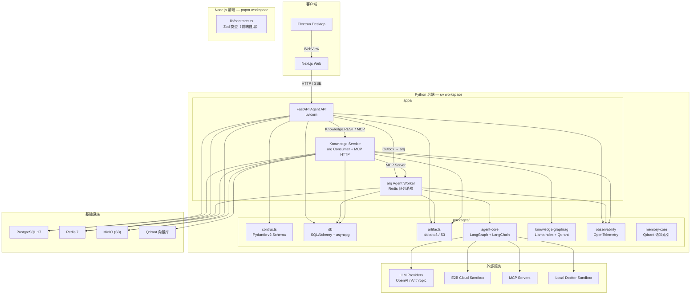
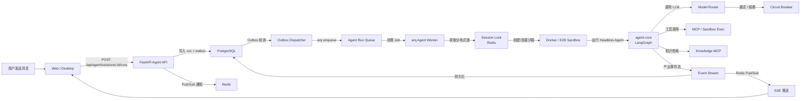
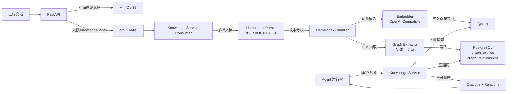
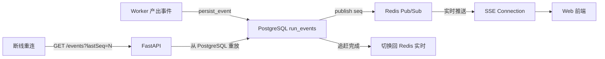

# Keen AI — Python Coding Agent Platform

面向多用户服务的 Coding Agent 平台。前端基于 Next.js Web + Electron 桌面客户端，后端已全部迁移到 Python：FastAPI BFF、arq Worker、LlamaIndex 知识库、LangGraph Agent 运行时，统一通过 `uv` workspace 管理。

## 系统架构



## 系统流程

### 会话与运行主流程

```
浏览器
  │ POST 创建 Run
  ▼
FastAPI
  │ 同一个 PostgreSQL 事务
  ├─ 写 agent_runs
  └─ 写 run_dispatch_outbox
           │
           ▼
    Outbox Dispatcher
           │ 投递到 arq，jobId = outboxId
           ▼
           Redis
           │
           ▼
         Worker
           │ Agent 每产生一个事件
           ├─ 写 PostgreSQL run_events，分配递增 seq
           └─ Redis Pub/Sub 发送"有新事件"通知
                         │
                         ▼
                       API SSE
                         │ 从 PostgreSQL 读取 seq > cursor
                         ▼
                       浏览器
```



### 知识库 RAG 流程



### 可恢复 SSE 事件流



## 当前能力

- **两种客户端**：Next.js Web、Electron 桌面客户端。
- **三种鉴权模式**：`AUTH_MODE=dev`（开发固定身份）、`AUTH_MODE=password`（本地用户名密码登录 + JWT 会话 Cookie）、`AUTH_MODE=oidc`（OIDC / JWT）。
- **角色级 RBAC**：`admin` 超级管理员 / `owner` 知识库拥有者 / `member` 普通用户，全部数据访问强制带租户上下文实现多租户隔离。
- **知识库管理**：admin 与知识库拥有者可增删改查知识库及文档；admin 可将知识库授权给指定用户（KB grants），被授权用户在聊天时可使用该知识库的 RAG 能力。
- **Knowledge Service**：基于 LlamaIndex 的独立微服务，arq 消费者 + MCP Server，Worker 通过 MCP 协议按 run 粒度检索知识库。
- **强制带租户上下文的 Session、Run、审批、提问、取消 API**。
- **Web 会话历史**：切换、恢复、重命名、软删除与 keyset 游标分页。
- **新建会话立即分配独立空白 workspace**，无需选择项目或上传代码。
- **PostgreSQL 持久化**：会话、运行、事件 cursor、interrupt、LangGraph checkpoint、知识图谱（实体/关系/分块）。
- **开发库与独立 `agent_test` 测试库/卷隔离**，集成测试不会污染本地会话列表。
- **arq Worker Pool**：session 分布式锁和 Redis 共享模型熔断状态。
- **PostgreSQL 事务 Outbox**：稳定 job id、发布重试和 Redis 丢失任务自动对账。
- **可恢复 SSE**：断线后从 PostgreSQL 重放事件，不会重新执行 Agent。
- **Headless Agent Core**：Deep Agents、MCP、模型重试/熔断/fallback、人工审批和取消。
- **沙箱双模式**：开发环境默认连接本机 Docker Sandbox；生产环境使用 E2B Cloud。
- **MinIO 对象存储**：artifact 数据模型，带租户前缀、大小限制、SHA-256 元数据校验的 S3 预签名上传和下载。
- **全链路可观测**：OpenTelemetry Traces + Metrics，Langfuse 按 run 采样，敏感字段脱敏。

## 目录结构

```text
apps/
├── web/                        Next.js Agent UI（Tailwind CSS + AI SDK）
└── desktop/                    Electron 桌面客户端（Keen AI）

python/
├── apps/
│   ├── api/                    FastAPI BFF、SSE、Outbox、认证与 RBAC
│   ├── worker/                 arq Agent Worker（沙箱管理、事件持久化）
│   └── knowledge-service/      LlamaIndex 知识服务（arq Consumer + MCP HTTP）
└── packages/
    ├── contracts/              Pydantic v2 Schema（API、事件、队列协议）
    ├── db/                     SQLAlchemy models + asyncpg repository + 迁移
    ├── artifacts/              aioboto3 S3/MinIO 对象存储
    ├── observability/          OpenTelemetry SDK + Langfuse 集成
    ├── memory-core/            长期记忆语义索引（Qdrant）
    ├── agent-core/             LangGraph + LangChain Agent 运行时
    └── knowledge-graphrag/     LlamaIndex 知识库引擎（解析/分块/嵌入/图抽取/检索）

infra/
├── compose.yaml                本地基础设施（Postgres × 2、Redis、Qdrant、MinIO）
├── mcp/                        MCP 配置文件（mcp.json）
└── sandbox/                    Docker 沙箱镜像构建

deploy/                         生产部署（systemd、nginx、compose、运维脚本）
```

## 本地启动

要求：Python 3.13+、uv、Node.js 22+、pnpm 11+、Docker。

```bash
# 1) 环境文件
cp .env.example .env
# 编辑 .env：填写 OPENAI_API_KEY、MODEL 等

# 2) 前端依赖
pnpm install

# 3) Python 依赖（首次）
cd python && uv sync --all-packages

# 4) 启动基础设施
pnpm infra:up          # Postgres × 2、Redis、Qdrant、MinIO

# 5) 数据库迁移
pnpm db:migrate

# 6) 一键启动全部服务（web + api + worker + knowledge-service）
pnpm dev
```

访问：

- Web：<http://localhost:3020>（或 `.env` 中 `PORT` 指定的端口）
- API 存活检查：<http://127.0.0.1:8002/health/live>
- API 就绪检查：<http://127.0.0.1:8002/health/ready>
- MinIO Console：<http://127.0.0.1:59001>

### Electron 桌面客户端

```bash
pnpm desktop:dev
```

该命令会自动启动本地基础设施、执行数据库迁移、拉起 Web/API/Worker，并在 Web 就绪后打开 Electron。关闭 Electron 后自动启动的开发服务会停止。

### 开发命令

```bash
# 前端
pnpm dev:web                  # 仅启动 Web
pnpm desktop:dev              # 启动桌面客户端 + 全部后端

# Python 后端（独立启动，用于调试）
cd python
uv run --no-sync python -m api.server          # FastAPI
uv run --no-sync python -m worker.worker       # arq Worker
uv run --no-sync python -m knowledge_service.main   # Knowledge Service

# 数据库
pnpm db:migrate               # 开发库迁移
pnpm infra:down               # 停止基础设施

# 质量检查
pnpm typecheck                # 前端类型检查
pnpm build                    # Turbo 生产构建
```

### 模型与沙箱配置

启动 Worker 前需在 `.env` 配置真实模型密钥和 Sandbox 凭据：

```dotenv
AGENT_DRIVER=deep
MODEL=openai:gpt-4o-mini
OPENAI_API_KEY=...
# 沙箱运行时：docker（默认，本机 Docker）或 e2b-cloud（E2B Cloud）
SANDBOX_RUNTIME=docker
# Docker 沙箱配置
DOCKER_SANDBOX_IMAGE=chat-agent-sandbox:latest
# E2B Cloud 配置（SANDBOX_RUNTIME=e2b-cloud 时必需）
# E2B_API_KEY=...
# FALLBACK_MODELS=anthropic:claude-sonnet-4
# ANTHROPIC_API_KEY=...
# MCP_CONFIG_PATH=infra/mcp/mcp.json
```

### 沙箱镜像构建

Worker 默认使用本机 Docker 沙箱，需要先构建镜像：

```bash
# 标准构建（需能访问 Docker Hub）
docker build -f infra/sandbox/Dockerfile -t chat-agent-sandbox:latest infra/sandbox

# 国内网络：使用 DaoCloud 镜像源
sed 's|FROM node:.*|FROM docker.m.daocloud.io/library/node:24.14.0-bookworm-slim|' \
  infra/sandbox/Dockerfile | docker build -f - -t chat-agent-sandbox:latest infra/sandbox
```

构建完成后 Worker 会自动拉取该镜像创建沙箱容器。

### Langfuse 本地观测

Langfuse 用于 LLM/Agent 链路追踪（trace、generation、tool call）。本地开发用 Docker Compose 快速启动：

```bash
# 启动 Langfuse v4（web + worker + Postgres + ClickHouse + Redis + MinIO）
docker compose -f deploy/langfuse-local/docker-compose.yml up -d --wait
```

- UI：<http://127.0.0.1:33002>
- 首次访问需注册账号，然后在 **Settings → API Keys** 创建密钥对
- 将密钥填入 `.env`：

```dotenv
LANGFUSE_PUBLIC_KEY=pk-lf-...
LANGFUSE_SECRET_KEY=sk-lf-...
LANGFUSE_BASE_URL=http://127.0.0.1:33002
LANGFUSE_ENABLED=true
LANGFUSE_SAMPLE_RATE=1
```

> 已内置 `LANGFUSE_MIGRATION_V4_WRITE_MODE=dual`，兼容当前 `@langfuse/langchain` v5 SDK。

停止 Langfuse：

```bash
docker compose -f deploy/langfuse-local/docker-compose.yml down
```

### 登录与角色 RBAC

`AUTH_MODE=password` 提供本地用户名密码登录（Web 登录页 `/login`），会话以 HTTP-only Cookie 中的 JWT 承载。配置：

```dotenv
AUTH_MODE=password
AUTH_JWT_SECRET=<openssl rand -hex 32 生成，至少 32 字符>
```

执行 `pnpm db:migrate` 后通过 Python 脚本或数据库直接插入默认租户与演示账号：

| 账号 | 密码 | 角色 | 权限 |
| --- | --- | --- | --- |
| `admin` | `admin123` | `admin` | 超级管理员：管理所有知识库、创建用户/分配角色、将知识库授权给任意用户 |
| `owner` | `owner123` | `owner` | 知识库拥有者：对自己拥有的知识库可增删改查及上传文档 |
| `user` | `user123` | `member` | 普通用户：仅可浏览被授权的知识库，并在聊天时使用其 RAG 能力 |

### 自助注册与提权流程

`AUTH_MODE=password` 下，登录页提供 `/register` 自助注册入口：

- 注册需用户名（3-64 位）、显示名、密码（≥8 位）；新账号一律为 `member`。
- 注册成功即自动登录（直接下发会话 Cookie）。
- 典型提权流程：新用户注册（member）→ admin 在 `/admin/users` 将其角色改为 `owner`（或将知识库授权给该 member）→ 该用户即可管理知识库或在聊天中使用被授权的 RAG 知识库。

### 长期记忆

平台默认启用按租户、用户和项目隔离的长期记忆。记忆事实保存在 PostgreSQL；配置完整的 `MEMORY_*` 环境变量后，Worker 会额外写入和召回独立的 Qdrant 语义索引。未配置时自动降级为 PostgreSQL-only，不影响聊天。

用户可在 Web 的"长期记忆"页面查看、编辑、删除或清空记忆；对话中也可以明确要求 Agent 记住或忘记某条信息。密码、Token、私钥等敏感内容会被拒绝保存。

## 常用命令

```bash
# 前端
pnpm typecheck          # 全量类型检查
pnpm test               # 运行所有单元测试
pnpm build              # Turbo 生产构建
pnpm infra:down         # 停止本地基础设施

# Python
uv sync --all-packages  # 安装/更新全部 Python 依赖
uv run --no-sync python -m db.migrate   # 数据库迁移
python3 -m compileall -q python/        # 语法检查

# 生产构建与部署
pnpm build
cd python && uv run --no-sync python -m api.server   # FastAPI 生产模式
cd python && uv run --no-sync python -m worker.worker  # Worker 生产模式
cd python && uv run --no-sync python -m knowledge_service.main  # Knowledge Service
```

## 技术栈

| 层 | 技术 |
| --- | --- |
| 前端 | Next.js 16、React 19、Tailwind CSS 4、AI SDK |
| 桌面 | Electron 44 |
| BFF (API) | FastAPI、Uvicorn、Pydantic v2、python-jose |
| Worker | arq、LangGraph、LangChain、Langfuse |
| 知识库 | LlamaIndex、Qdrant、pdfjs-dist、mammoth、xlsx |
| 数据库 | PostgreSQL 17、SQLAlchemy、asyncpg |
| 缓存/队列 | Redis 7、arq |
| 对象存储 | MinIO（S3 兼容）、aioboto3 |
| 可观测 | OpenTelemetry、Langfuse |
| 沙箱 | Docker / E2B Cloud |
| Python 构建 | uv workspace、Hatchling |
| Node.js 构建 | Turbo、pnpm workspace |
