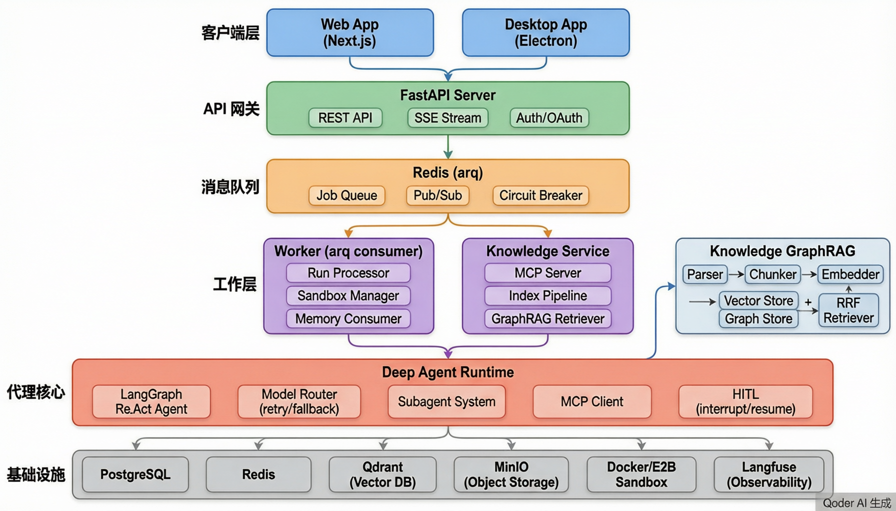
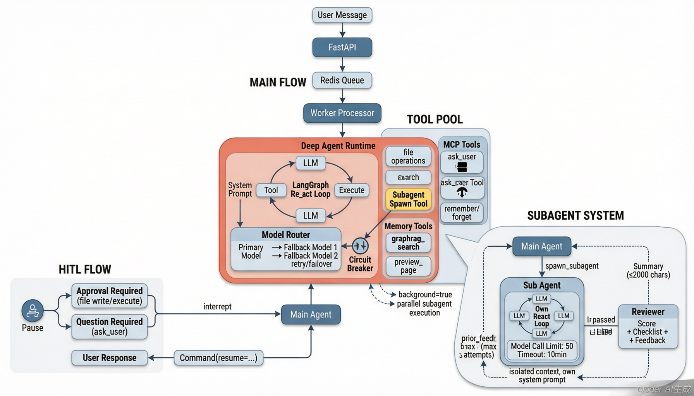
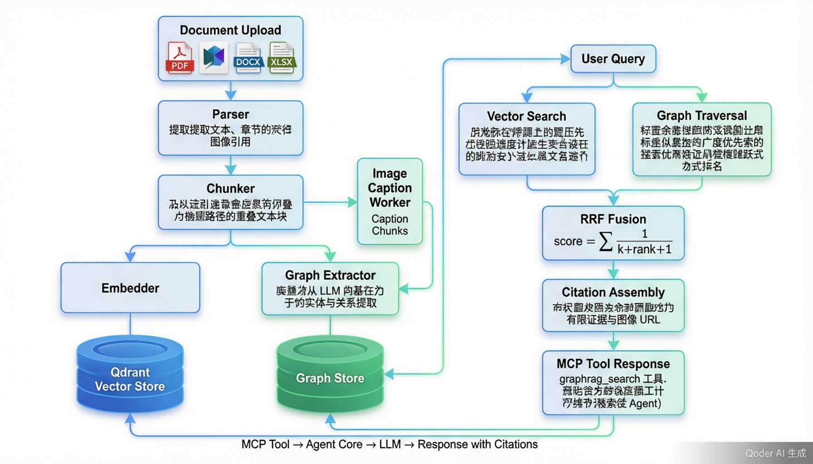

## 一、整体架构



### 技术栈概览

这是一个 **Monorepo** 项目，前端用 TypeScript/Next.js，后端用 Python（FastAPI + LangGraph），通过 pnpm workspace + uv workspace 管理。

| 层级 | 技术 | 位置 |
|------|------|------|
| Web 前端 | Next.js + React | `apps/web/` |
| 桌面端 | Electron | `apps/desktop/` |
| API 服务 | FastAPI (Python) | `python/apps/api/` |
| Worker 任务处理 | arq (Redis 队列) | `python/apps/worker/` |
| 知识库服务 | FastMCP (MCP 协议) | `python/apps/knowledge-service/` |
| Agent 核心 | LangGraph + LangChain | `python/packages/agent-core/` |
| 知识图谱 RAG | Qdrant + Graph Store | `python/packages/knowledge-graphrag/` |
| 数据库 | PostgreSQL | `python/packages/db/` |
| 基础设施 | Docker Compose | `infra/compose.yaml` |

### 核心数据流

```
用户消息 → Web/Desktop → FastAPI API → Redis 队列(arq)
    → Worker 消费 → 获取沙箱(Docker/E2B) → 创建 DeepAgent Runtime
    → LangGraph ReAct 循环(LLM ↔ 工具调用) → SSE 事件流 → 前端渲染
```

### 基础设施层

在 [compose.yaml](infra/compose.yaml) 中定义了 5 个核心服务：

- **PostgreSQL 17** — 持久化存储（会话、运行记录、事件、知识库元数据）
- **Redis 7.4** — 消息队列（arq 任务调度）+ Pub/Sub（事件推送）+ 熔断器状态
- **Qdrant** — 向量数据库（知识库文档的 embedding 存储与检索）
- **MinIO** — 对象存储（工件、附件、项目快照）

---

## 二、Agent 系统详解



Agent 系统是整个平台的核心智能引擎，实现在 [agent-core](python/packages/agent-core/src/agent_core) 包中。

### 2.1 Deep Agent Runtime

核心入口是 [deep_agent.py](python/packages/agent-core/src/agent_core/deep_agent.py) 中的 `create_deep_agent_runtime()` 函数，它组装出一个完整的 Agent 运行句柄：

```python
# 运行时结构
HeadlessAgentRuntime:
    run(message, images) → AsyncIterator[AgentEvent]    # 首次运行
    resume(input) → AsyncIterator[AgentEvent]            # 恢复(审批/回答)
    dispose() → None                                      # 清理资源
```

**关键组装步骤：**

1. **模型路由** — 通过 [model_router.py](python/packages/agent-core/src/agent_core/model_router.py) 创建弹性模型路由，支持：
   - 多候选模型按优先级降级（fallback）
   - 指数退避重试（最多 4 次，500ms→8s）
   - 熔断器保护（内存/Redis 实现）
   - 图片块归一化（MCP 格式 → OpenAI 兼容格式）

2. **工具池组装** — 把多种工具整合到一个工具列表中：
   - `ask_user` — 通过 LangGraph `interrupt` 实现的用户提问
   - `spawn_subagent` — 子 Agent 派发工具
   - `preview_page` — 页面预览生成
   - `remember_fact` / `forget_memory` — 长期记忆工具
   - MCP 工具（文件操作、命令执行、`graphrag_search` 等）

3. **HITL（人机交互）包装** — 对文件写入/删除/命令执行等危险操作包装 `interrupt` 审批流

4. **系统提示词构建** — 根据配置动态生成，包含沙箱规则、知识库检索策略、预览规则等

### 2.2 LangGraph ReAct 循环

Agent 的核心执行循环基于 LangGraph 的 `create_react_agent`：

```
用户消息 → [LLM 推理] → 是否有工具调用？
    ├── 是 → [执行工具] → [LLM 继续推理] → ...
    └── 否 → 输出最终回复
```

流式事件类型包括：
- `assistant.delta` — 文本增量
- `assistant.reasoning` — 思考过程
- `tool.started` / `tool.completed` — 工具执行状态
- `todo.updated` — 任务清单更新
- `usage.updated` — Token 用量
- `approval.required` / `question.required` — 需要用户交互
- `run.completed` / `run.failed` / `run.cancelled` — 运行终态

### 2.3 子 Agent 系统

实现在 [subagent.py](python/packages/agent-core/src/agent_core/subagent.py) 中，这是整个系统最精妙的部分之一：

**派发流程：**
```
主 Agent 调用 spawn_subagent 工具
    → 创建隔离子 Agent（独立消息栈、独立系统提示）
    → 子 Agent 执行（模型调用上限 50 轮，墙钟超时 10 分钟）
    → 提取摘要（≤2000 字符）
    → P2 评审器打分（结构化 LLM 输出）
    → 不达标？带 feedback 重派（最多 3 轮）
    → 通过 → 摘要返回主 Agent
```

**关键设计：**
- **上下文隔离** — 子 Agent 不继承主对话历史，只接收 `role_prompt + task + context`
- **工具策略过滤** — 剔除 `spawn_subagent`（防递归）、`ask_user` 等工具
- **评审闭环（P2）** — 独立评审器按验收标准逐条打分，不达标带整改意见重派
- **后台执行（P3）** — `background=true` 时工具立即返回 taskId，主 Agent 不阻塞，完成后系统自动续轮

### 2.4 Worker 任务处理

[processor.py](python/apps/worker/src/worker/processor.py) 是任务消费端：

```
Redis 队列 → _run_processor()
    → 获取会话锁（防并发）
    → 获取/创建沙箱（Docker 或 E2B）
    → 并行准备：工作区 + 附件 + Agent 资源 + 长期记忆
    → 创建 DeepAgent Runtime
    → 流式执行 Agent → 每个事件持久化到 DB + 发布到 Redis Pub/Sub
    → 前端通过 SSE 订阅实时渲染
```

---

## 三、知识库系统（GraphRAG）



知识库是平台的第二大核心能力，实现在 [knowledge-graphrag](python/packages/knowledge-graphrag/src/knowledge_graphrag) 包和 [knowledge-service](python/apps/knowledge-service/src/knowledge_service) 应用中。

### 3.1 索引流水线（Indexing Pipeline）

核心在 [indexer.py](python/packages/knowledge-graphrag/src/knowledge_graphrag/indexer.py) 的 `IndexPipeline`：

```
文档上传（PDF/MD/DOCX/XLSX）
    → Parser（解析文本 + 章节结构 + 图片引用）
    → Chunker（分块：可配置大小和重叠，保留 heading_path）
    → 图片 Caption 合成 chunk（序号 9000+ 避开文本 chunk）
    → Embedder（批量向量化，OpenAI 兼容接口）
    → Qdrant 向量存储（按 tenant_id/kb_id/document_id 索引过滤）
    → Graph 抽取（LLM 提取实体+关系 → Graph Store）
```

**关键细节：**
- **文档解析** — [parser.py](python/packages/knowledge-graphrag/src/knowledge_graphrag/parser.py) 支持 `text/plain`、`text/markdown`、`application/pdf`、`docx`、`xlsx`
- **分块策略** — [chunker.py](python/packages/knowledge-graphrag/src/knowledge_graphrag/chunker.py) 按字符区间切分，保留章节层级路径（`heading_path`）和图片引用（`image_refs`）
- **图片 Caption** — [caption_worker.py](python/apps/knowledge-service/src/knowledge_service/caption_worker.py) 异步为文档中的图片生成描述，作为合成 chunk 参与向量召回
- **图谱抽取** — [extract.py](python/apps/knowledge-service/src/knowledge_service/extract.py) 用 LLM 从每个 chunk 中提取实体和关系

### 3.2 检索流水线（Retrieval Pipeline）

核心在 [retriever.py](python/packages/knowledge-graphrag/src/knowledge_graphrag/retriever.py) 的 `merge_candidates()` 函数，采用 **双路召回 + RRF 融合**：

```
用户查询
    ├── 向量路：Qdrant cosine 相似度检索 → VectorHit[]
    └── 图谱路：种子实体 → BFS 遍历 → GraphRelation[]
    
    → RRF 融合（Reciprocal Rank Fusion）
      score(chunk) = Σ 1/(k + rank_i + 1)，k=60
      同时被两路命中的 chunk 自然获得更高分
    
    → 按 RRF 分数降序排列 → 取 top-K
    
    → 证据组装：bounded evidence + citation + 图片 URL 代理
```

**RRF 融合的精妙之处：**
- 向量路 rank 来自 Qdrant 的 cosine 排序
- 图谱路 rank 来自 hop 升序（hop=1 的关系更近，rank 更小）
- 两路同时命中的 chunk 会叠加分数，自然提升排名
- 与原始 score 解耦，输出分数落在 `(0, 2/(k+1)]` 区间

### 3.3 MCP 服务暴露

知识库通过 **MCP（Model Context Protocol）** 协议暴露给 Agent：

[mcp_server.py](python/apps/knowledge-service/src/knowledge_service/mcp_server.py) 实现了 `graphrag_search` 工具：

```python
@mcp.tool(name="graphrag_search")
async def graphrag_search(query, topK, includePassage):
    # 1. JWT 鉴权（run token，5 分钟有效，绑定 run + kb_ids）
    claims = verify_run_token(authorization, token_secret)
    
    # 2. 执行 GraphRAG 检索
    result = retriever.retrieve(RetrieveParams(...))
    
    # 3. 返回有界证据文本 + 结构化 metadata
    content = format_bounded_evidence(result)  # "[S1] ... [S2] ..."
    structured = bounded_retrieval_metadata(result)  # citations, relations, stats
    return content, structured
```

Agent 端通过 `langchain-mcp-adapters` 连接这个 MCP 服务，`graphrag_search` 就像本地工具一样被 Agent 调用。

### 3.4 知识库数据模型

类型定义在 [types.py](python/packages/knowledge-graphrag/src/knowledge_graphrag/types.py)：

```
ParsedDocument → TextChunk（带 heading_path, image_refs）
    → GraphEntity / GraphRelationship（图谱抽取结果）
    → VectorHit（向量召回）/ GraphTraversal（图谱遍历）
    → CandidateEvidence（融合后的候选，标记 via: vector/graph/vector+graph）
```

### 3.5 知识图谱存储

[graph.py](python/packages/knowledge-graphrag/src/knowledge_graphrag/graph.py) 实现了 `InMemoryGraphStore`：

- **实体归一化** — 去空格、转小写
- **BFS 遍历** — 从种子实体出发，按 hop 逐层扩展，受 `max_hops`/`max_fanout`/`max_relations` 限制
- **文档删除** — 级联清理实体和关系

---

## 总结

这个项目的架构可以用三个关键词概括：

1. **事件驱动** — API 写入 Redis 队列 → Worker 消费 → Agent 流式产出事件 → 持久化 + Pub/Sub → SSE 推送前端
2. **LangGraph ReAct Agent** — 基于 LangGraph 的 React Agent 循环，支持工具调用、HITL 审批/提问、子 Agent 派发与评审闭环、模型降级/重试/熔断
3. **GraphRAG 双路召回** — 向量检索 + 知识图谱遍历，通过 RRF 融合排序，以 MCP 协议暴露给 Agent，实现私有知识库的增强检索生成